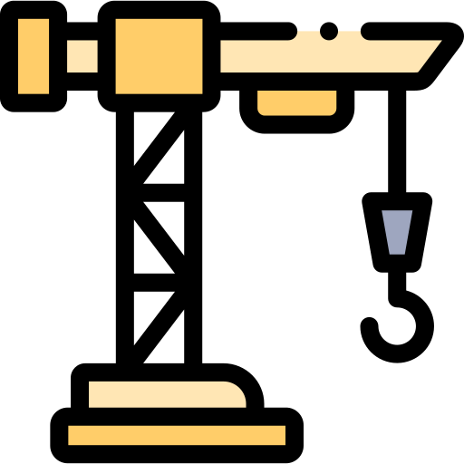

 

 

# About
Falacz is an application made for education purposes only. I wanted to copy some of twitter's functionalities.

# Under Construction

This repository has the backend code of an application that I'm developing for a college project and to practice coding with java and spring MVC framework.

# Things I plan to do

- [X] Register users
- [X] Authenticate user
- [ ] User's post CRUD
- [ ] Realtime chat with a microservice (maybe)

# Suggestions

Found something that I did it wrong, or I could do in a better way? Fell free to open an issue, I will appreciate that a lot!

# Credits

Svg: icon made by <a href="https://www.freepik.com" title="Freepik">Freepik</a> from <a href="https://www.flaticon.com/" title="Flaticon">www.flaticon.com</a>